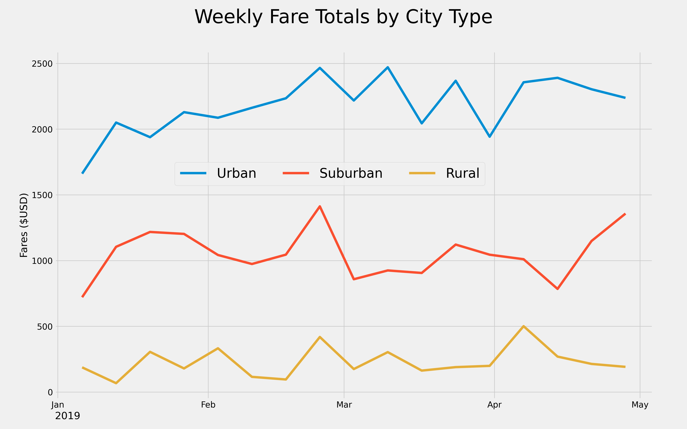
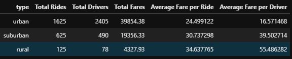

# The PyBer Challenge
## An Analysis of Ride Sharing Trip Data
### Richard E Barber 2021
#### Data Analysis And Visualization

<hr>

|    |
|:----:|
| Overview |
|    |

The purpose of this analytical task is to create a visualization of weekly fare totals by city type.  The three types of city under consideration in this analysis are Rural, Suburban, and Urban.  One of the datasets made available to the analyst includes the type of city- we will use this data to construct a dataframe that is resampled per-week and graphed per city type on the same axes.

|    |
|:----:|
| Results |
|    |

Information such as the number of drivers per city type was generated by codes such as the following:
```
# 2. Get the total drivers for each city type
# Get the TOTAL number of drivers for each urban city.
urban_driver_count = city_data_df.groupby('type').sum().loc['Urban']
# Get the TOTAL number of drivers for each city for the suburban and rural cities.
rural_driver_count = city_data_df.groupby('type').sum().loc['Rural']
suburban_driver_count = city_data_df.groupby('type').sum().loc['Suburban']
[urban_driver_count, suburban_driver_count, rural_driver_count]
```
Which generates the following output:
`[driver_count    2405
 Name: Urban, dtype: int64,
 driver_count    490
 Name: Suburban, dtype: int64,
 driver_count    78
 Name: Rural, dtype: int64]`

This type of data is useful in creating visualizations such as the pie chart, because each element represents a part of a whole. For example, with the code `plt.pie(chartTheseData, labels=['Urban', 'Suburban', 'Rural'], shadow= True, startangle=90, explode=[.1,.1,.2], autopct='%1.1f%%')`, python will generate this type of pie chart:

</img>


|    |
|:----:|
| Summary |
|    |

In summary, we are presenting the following business recommendations based on our analysis directly to the client CEO:
* Increase driver participation in the Rural sector.

</img>

Here it is seen that Rural drivers are generating a substantially lower amount of fares compared with drivers based in Suburban and Urban cities.

* Offer drivers incentives for serving the Rural sector.
* Educate drivers on the benefits of serving the Rural sector.
 
</img>

Here it is seen that Rural drivers earn much more per fare per trip.

* Increase rider participation in the Suburban sector.
 
</img>

In this chart it is shown that the Suburban sector, although in the middle between Rural and Urban, has potentially the greatest room for increase in fares generated.
